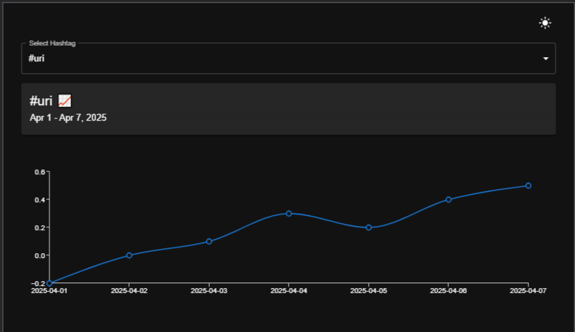
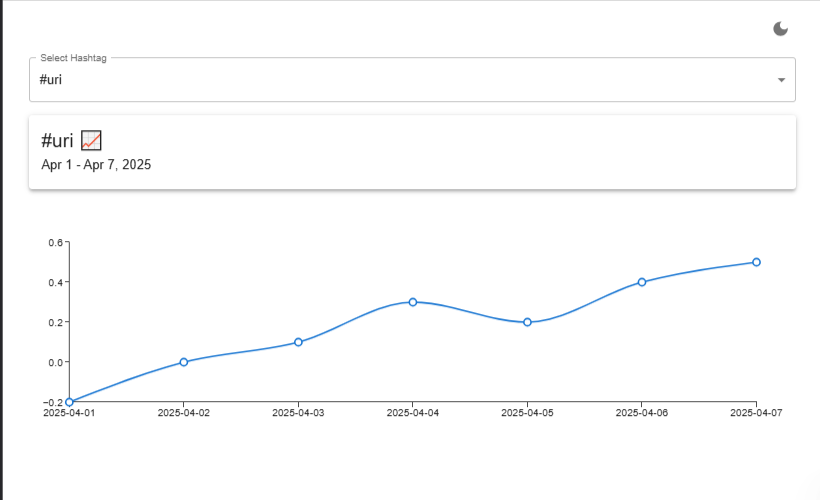
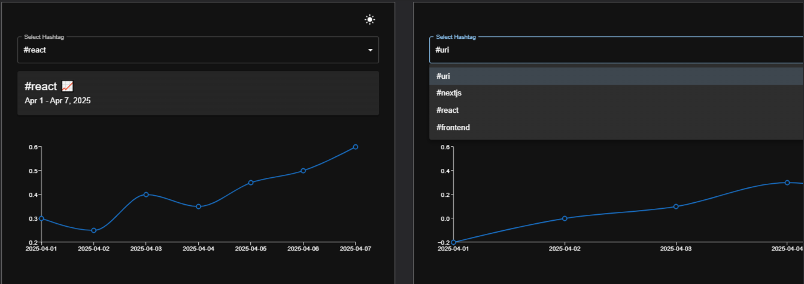
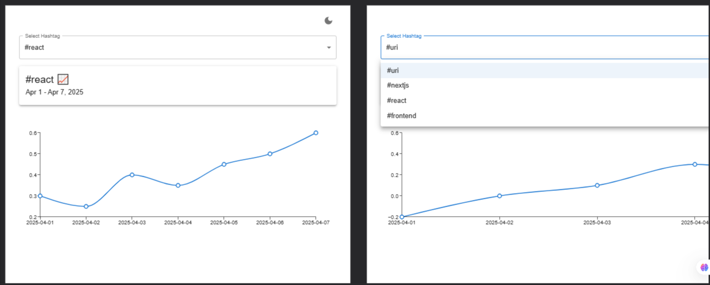
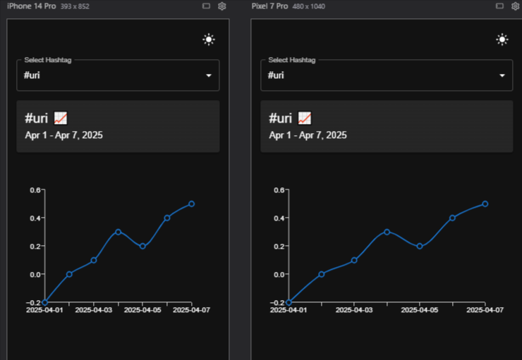
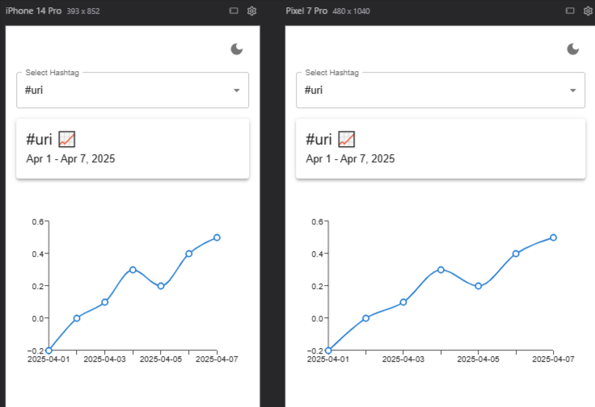

# Hashtag Sentiment Insight Dashboard - README

## Overview

This Next.js application provides sentiment trend visualization for social media hashtags with a dynamic route `/insights/[hashtag]`. The dashboard features interactive charts, multiple view modes, and responsive layouts.

## Features

✅ Dynamic route handling for any hashtag  
✅ Hashtag switcher dropdown  
✅ Interactive line chart with min/max markers  
✅ Light & dark mode support  
✅ Responsive design (mobile, tablet, desktop)  
✅ Loading and error states  
✅ Performance optimizations  

## Screenshots

### Desktop Views
| Dark Mode | Light Mode |
|-----------|------------|
|  |  |

### Tablet Views
| Dark Mode | Light Mode |
|-----------|------------|
|  |  |

### Mobile Views
| Dark Mode | Light Mode |
|-----------|------------|
|  |  |

## Technical Implementation

### Key Components

1. **Hashtag Switcher**
   - Dropdown with popular hashtags
   - Client-side navigation between trends
   - Persists in all viewports

2. **Enhanced Sentiment Chart**
   - Min/Max sentiment markers (dotted lines)
   - Custom tooltips with date/sentiment values
   - Responsive sizing

3. **View Mode Toggle**
   - System-preference detection
   - Manual light/dark mode switch
   - Theme-appropriate chart colors

4. **Responsive Layout**
   - Mobile: Stacked elements, larger touch targets
   - Tablet: Adjusted spacing, medium-sized charts
   - Desktop: Side-by-side components, detailed views

## How to Run

```bash
git clone [repository-url]
npm install
npm run dev
```

## Live Demo

Deployed on Vercel:  
[Creative URI hashtag sentiment ](https://uricreative.vercel.app/insights/uri)

## Time Spent

Total: ~3 hours (including bonus features)

- 45 mins: Base functionality
- 1 hour: Bonus features implementation
- 45 mins: Responsive design & testing
- 30 mins: Documentation & deployment
